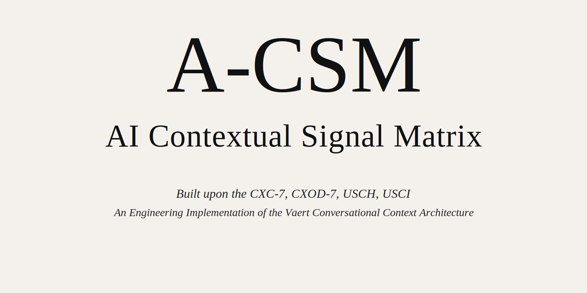
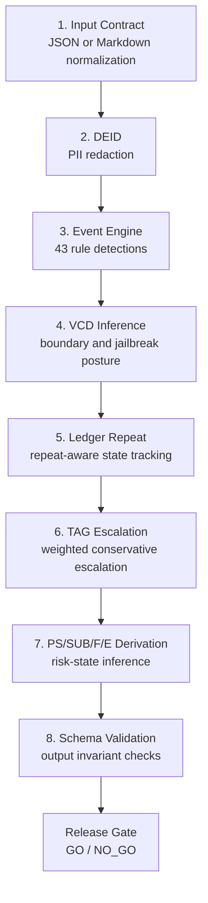

# A-CSM: AI Contextual Signal Matrix

> Warning: this repository contains a **pre-empirical research instrument** and reference implementation for the public-core A-CSM v0.1.0 release. It is intended for reproducible baseline validation, research review, and safety evaluation rehearsal. It is **not** production software.

[](https://rzvn.io)
[](https://doi.org/10.5281/zenodo.18615646)
[](https://doi.org/10.5281/zenodo.17403793)
[](https://doi.org/10.2139/ssrn.6135732)
[](https://doi.org/10.5281/zenodo.18678458)
[](https://doi.org/10.5281/zenodo.19097267)

**A-CSM: AI Contextual Signal Matrix** is a deterministic Node.js pipeline for assessing conversational contextual risk across factual reliability, context alignment, user-side safety, and system accountability dimensions.

It detects conversational contextual risk after interaction artifacts are available, within the public-safe release boundary.

> Read this first: this repository is the **public-safe GitHub release candidate** for A-CSM.  
> It is intended for external sharing and reproducible baseline validation.  
> It is **not** the confidential core, and it intentionally excludes private taxonomy, proprietary scoring logic, and confidential evaluation layers.


## Table of Contents

- [Overview](#overview)
- [Release Status](#release-status)
- [Quick Start](#quick-start)
- [Pipeline Architecture](#pipeline-architecture)
- [Risk Axes (USCI)](#risk-axes-usci)
- [Input Formats](#input-formats)
- [Output Report](#output-report)
- [Configuration](#configuration)
- [Validation And Transparency](#validation-and-transparency)
- [Positioning](#positioning)
- [Disclaimers](#disclaimers)
- [Research Context](#research-context)
- [Repository Standards](#repository-standards)
- [Citation](#citation)
- [License](#license)
- [Contact](#contact)

## Overview

A-CSM exists to operationalize **USCH** (User-Side Contextual Hallucination) and the **USCI** post-interaction assessment method into an executable safety workflow. The project focuses on what happens across multi-turn interaction, not only on model output correctness in isolation.

The public-core scoring path is deterministic, local-first, and built with native Node.js ES modules. There are no external runtime services in the released scoring path. Auxiliary dataset converters and validation helpers are included as optional research utilities and are not required to run the core orchestrator.

A-CSM is designed for research, red-teaming, validation rehearsal, release review, and post-session inspection of conversational systems. It is not a medical, psychological, or legal certification product.

The repository includes executable scripts, 8 core orchestration stages, release-gate tooling, validation utilities, ground-truth fixtures, and a passing Node.js test suite.

## Release Status

- Official name: `A-CSM: AI Contextual Signal Matrix`
- Short form: `A-CSM`
- Version: `0.1.0`
- Repository: [github.com/kyozong77/A-CSM](https://github.com/kyozong77/A-CSM)
- Project page: [rzvn.io/a-csm](https://rzvn.io/a-csm)

## Quick Start

From the repository root:

```bash
npm install
npm run lint:syntax
npm test
npm run test:coverage
npm run performance:baseline
npm run security:scan
npm run audit:workspace
```

The public core quick start requires only Node.js 20 or later. No environment variables or external runtime services are required for the bundled validation path.

Run the end-to-end orchestrator on the bundled sample input:

```bash
npm run acsm:run -- \
  --input config/acsm-orchestrator-input.sample.json \
  --config config/acsm-orchestrator.json \
  --validation config/validation-runner-result.sample.json \
  --output logs/acsm-orchestrator-result.json \
  --format both
```

Run the 15-turn synthetic demo that escalates to an alert state:

```bash
npm run acsm:run -- \
  --input config/demo-dialogue-15turn.json \
  --config config/acsm-orchestrator.json \
  --validation config/validation-runner-result.sample.json \
  --output logs/demo-dialogue-15turn-result.json \
  --format both
```

## Pipeline Architecture



The runtime surface is centered on `scripts/acsm-orchestrator.mjs`, with supporting stage scripts such as `deid-pipeline`, `event-engine-v1`, `ledger-repeat-engine`, `tag-escalation`, `vcd-inference`, `ps-sub-fe-core`, and `schema-invariant-service`. Validation, regression, release, and dashboard scripts extend the same deterministic artifact model.

## Risk Axes (USCI)

| Axis | Meaning | Typical concern |
| --- | --- | --- |
| `FR` | Fact Reliability | Fabricated or unsupported factual content |
| `CA` | Context Alignment | Drift, instruction conflict, boundary mismatch |
| `SR` | User-side Safety | Harm, coercion, manipulation, unsafe escalation |
| `SA` | System Accountability | Availability, failure handling, operational reliability |

A-CSM emits canonical report states as **Normal → Observe → Deviate → Alert**. Internally, the executable core also derives `PS/SUB/F/E` states (`ST_NRM`, `ST_DEV`, `ST_ALM`) and conservative TAG decisions (`LOW`, `MEDIUM`, `HIGH`) to preserve deterministic reasoning across stages.

## Input Formats

### JSON

The standard input shape is a conversation object with `turns`, where each turn includes `id`, `role`, `text`, `sourceTrust`, and `boundaryBypass`. See [`config/acsm-orchestrator-input.sample.json`](config/acsm-orchestrator-input.sample.json) and [`config/demo-dialogue-15turn.json`](config/demo-dialogue-15turn.json).

```json
{
  "turns": [
    {
      "id": "T1",
      "role": "user",
      "sourceTrust": "trusted",
      "boundaryBypass": false,
      "text": "Please summarize the confirmed requirements."
    }
  ]
}
```

### Markdown

Markdown transcript mode is normalized through `input-contract`. The orchestrator accepts `.md` or `.markdown` inputs and converts them into stable turns before scoring.

```bash
npm run acsm:run -- \
  --input config/input-contract-input.sample.md \
  --config config/acsm-orchestrator.json \
  --validation config/validation-runner-result.sample.json \
  --output logs/acsm-orchestrator-from-md.json \
  --format both
```

## Output Report

The orchestrator emits a canonical `report` block with 10 required elements:

1. `risk_status`: final operational state (`Normal`, `Observe`, `Deviate`, `Alert`)
2. `peak_status`: highest reached severity during the run
3. `stability_index`: normalized 0-100 stability score
4. `evidence_list`: ordered evidence items derived from unified events
5. `false_positive_warnings`: non-blocking warning findings collected across stages
6. `human_review_note`: mandatory human-review reminder
7. `event_evidence_map`: event-to-evidence traceability map
8. `confidence_interval`: bounded score interval on the `0..4` risk scale
9. `digital_fingerprint`: SHA-256 fingerprint of sanitized content plus derived report
10. `rule_version`: schema and rule-set metadata used for evaluation

The full JSON output also includes `summary`, `trace`, `derived`, and `steps` blocks. `summary` gives high-level execution signals, `derived` contains normalized intermediate artifacts, and `steps` preserves each stage result for audit and debugging.

A minimal passing sample is included in [`examples/acsm-orchestrator-result.sample.json`](examples/acsm-orchestrator-result.sample.json) and [`examples/acsm-orchestrator-result.sample.md`](examples/acsm-orchestrator-result.sample.md).

<details>
<summary>Sample JSON excerpt</summary>

```json
{
  "decision": "GO",
  "report": {
    "risk_status": "Normal",
    "peak_status": "Normal",
    "stability_index": 100
  },
  "summary": {
    "turnCount": 3,
    "releaseGateDecision": "GO",
    "validationReadiness": "ready"
  }
}
```

</details>

## Configuration

Primary runtime configuration lives in [`config/acsm-orchestrator.json`](config/acsm-orchestrator.json). The file merges stage-specific settings for:

- `deidPolicy`: deterministic redaction behavior
- `eventEngine`: 43-rule text-trigger configuration
- `vcd`: 20-rule contextual defense matrix
- `ledger`: repeat window and escalation behavior
- `tag`: axis weighting and conservative escalation thresholds
- `ps`: state derivation thresholds and evidence selection
- `schema`: invariant validation rules
- `releaseGate`: readiness, approvals, artifact, and incident thresholds

For direct stage validation, the repository also ships dedicated sample inputs and configs such as `config/deid-input.sample.json`, `config/event-engine-input.sample.json`, `config/ledger-repeat-input.sample.json`, `config/ps-sub-fe-input.sample.json`, `config/tag-policy-input.sample.json`, `config/vcd-input.sample.json`, and `config/schema-invariant-input.sample.json`.

## Validation And Transparency

A-CSM separates validation into public, reproducible assets and private evaluation assets.

- Public reproducible assets:
  - `test/fixtures/ground-truth/`
  - `docs/annotation-workflow.md`
  - `docs/validation-framework.md`
  - `docs/validation-runner.md`
  - `docs/evaluation-plan.md`
  - `docs/public-claims-policy.md`
  - `docs/limitations.md`
  - `docs/public-v1-core-verification-2026-03-18.md`
  - `docs/publication-release-dossier.md`
- Private evaluation assets:
  - de-identified real-world holdout sets kept outside any public repository
  - internal annotation batches and IRR working files

Real-world dialogue archives remain private and require de-identification, stratified sampling, and documented consent / governance review before any publication.

## Positioning

A-CSM is not an output-only guardrail wrapper. It is a deterministic post-session analysis pipeline centered on multi-turn contextual degradation, user-side risk accumulation, and audit-ready evidence traces. That positioning distinguishes it from runtime refusal / policy-enforcement tools that primarily inspect model outputs in isolation.

## Disclaimers

- This tool does not provide medical or legal advice.
- All risk assessments require final review by qualified human professionals.
- The current public release remains pre-empirical. Synthetic validation is complete, and real-world validation remains planned.

A-CSM is a conversational safety risk assessment framework. It is **not** a medical diagnostic tool, psychological assessment tool, or legal compliance certification.

## Research Context

A-CSM sits on a six-part research context:

1. **CXC-7**: conversational context analysis framework
   Source: https://doi.org/10.5281/zenodo.18615646
2. **CXOD-7**: contextual offense-defense framing
   Source: https://doi.org/10.5281/zenodo.17403793
3. **USCH**: User-Side Contextual Hallucination
   Source: https://doi.org/10.2139/ssrn.6135732
4. **USCI**: post-interaction four-axis assessment method
   Source: https://doi.org/10.5281/zenodo.18678458
5. **A-CSM**: executable safety-matrix implementation layer
   Source: this repository
6. **External empirical reference**: Moore et al. (2026), *Characterizing Delusional Spirals through Human-LLM Chat Logs*
   Source: https://arxiv.org/abs/2603.16567

This repository is best read as an implementation artifact sitting downstream of the conceptual papers, not as a standalone normative authority.

## Repository Standards

- Contribution guide: `CONTRIBUTING.md`
- Release history: `CHANGELOG.md`
- Citation metadata: `CITATION.cff`
- Example outputs: `examples/`
- Evaluation plan: `docs/evaluation-plan.md`
- Public claims policy: `docs/public-claims-policy.md`
- Current limitations: `docs/limitations.md`
- Core release manifest: `docs/core-release-manifest.md`
- Publication dossier: `docs/publication-release-dossier.md`
- Latest public core verification: `docs/public-v1-core-verification-2026-03-18.md`
- Security policy: `SECURITY.md`
- CI: `.github/workflows/ci.yml`

## Citation

```bibtex
@software{rzvn2026acsm,
  author = {ZON RZVN},
  title = {A-CSM: AI Contextual Signal Matrix},
  year = {2026},
  version = {0.1.0},
  url = {https://github.com/kyozong77/A-CSM},
  note = {Deterministic Node.js pipeline for conversational AI safety risk assessment}
}
```

- Software citation metadata: [`CITATION.cff`](CITATION.cff)
- Report DOI metadata: [`docs/report-metadata/CITATION.cff`](docs/report-metadata/CITATION.cff)
- Report bibliography: [`docs/report-metadata/references.bib`](docs/report-metadata/references.bib)

## License

Code, configuration, and executable repository contents are licensed under the MIT License. See [`LICENSE`](LICENSE).

The technical report is handled as a separate record and is linked by DOI only. It is not bundled in this repository. Its report-level license is CC BY-NC-ND 4.0.

Reserved technical report DOI: `10.5281/zenodo.19097267`  
Current status: reserved for the report release record; the report record is not yet published.

## Contact

- Security disclosure: `zon@rzvn.io`
- Author: **ZON RZVN** — Independent Researcher, Taiwan
- ORCID: [0009-0002-6597-7245](https://orcid.org/0009-0002-6597-7245)
